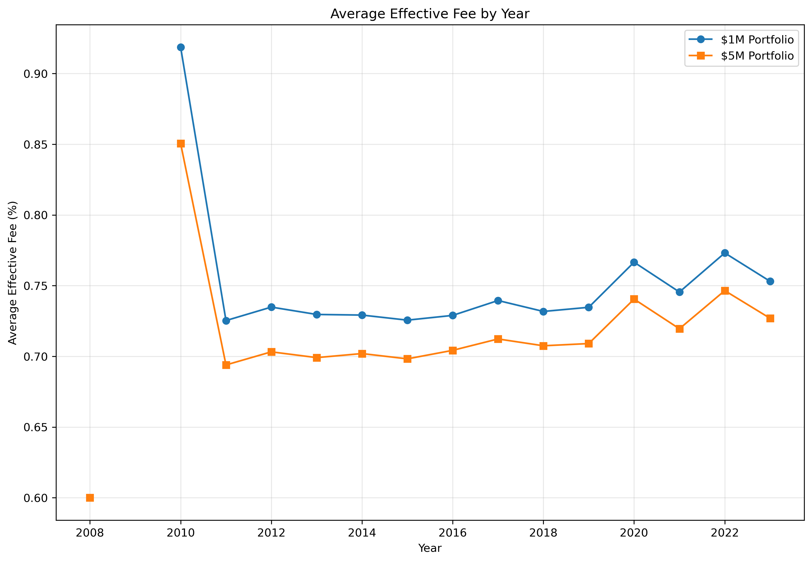
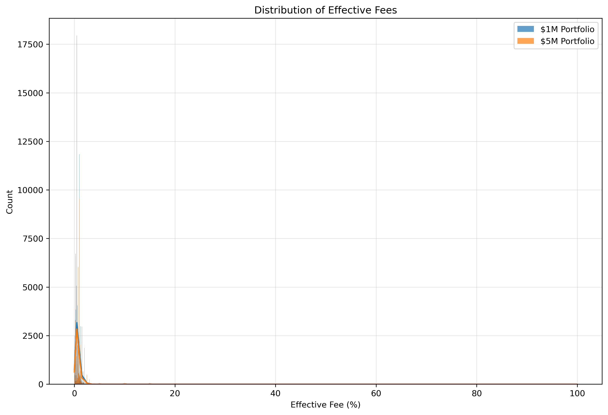
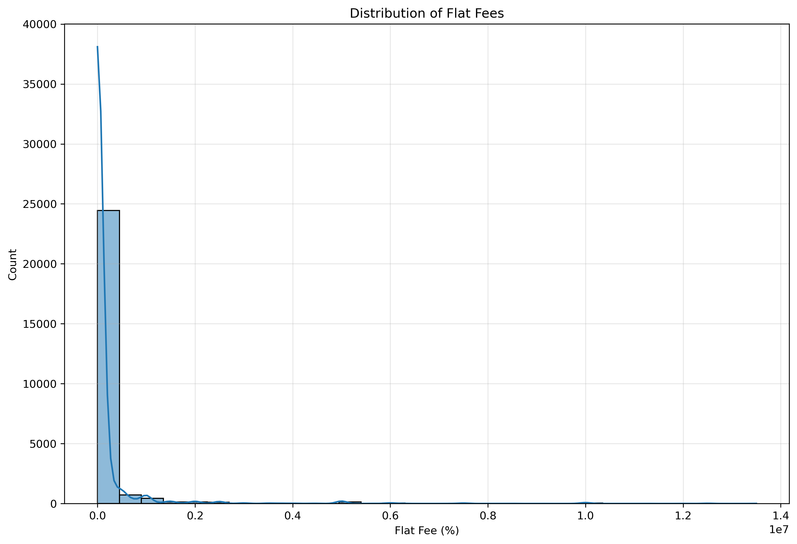
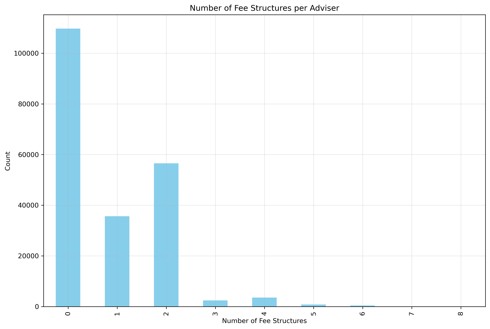
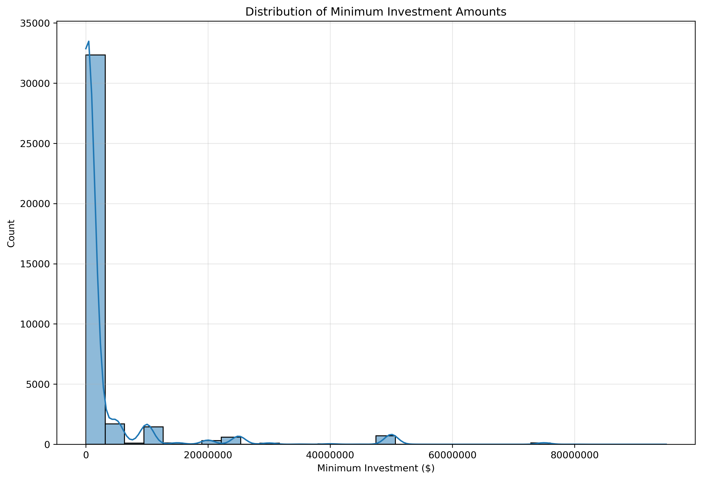
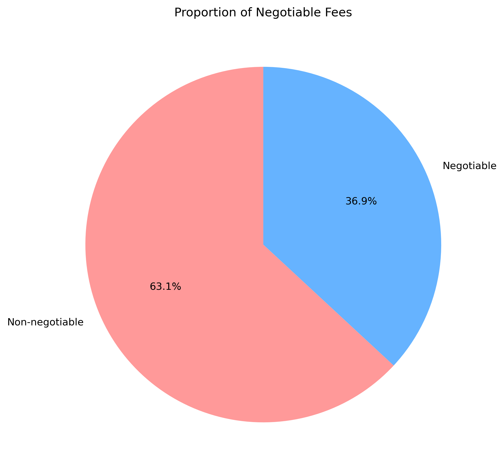

# Financial Advisor Fee Data Analysis

This repository contains Python scripts for cleaning, analyzing, and visualizing fee data from financial advisors' regulatory filings (Form ADV brochures and Part 2 forms).

## Overview

The analysis focuses on understanding fee structures, minimum investments, and negotiability of fees across financial advisors from 2007 to 2023. The data was extracted from regulatory filings using LLM (Large Language Model) and then verified.

## Repository Structure

```
financial-advisor-fee-analysis/
│
├── data/                      # Data directory
│   ├── raw/                   # Raw CSV files extracted from regulatory filings
│   └── processed/             # Cleaned and processed data files
│       ├── cleaned_fee_data_ordered.csv  # All processed records with original order preserved
│       └── unique_fee_data_ordered.csv   # Unique records per adviser per year
│
├── docs/                      # Documentation
│   └── fee_data_analysis_report.md  # Detailed report of findings
│
├── images/                    # Visualizations
│   ├── fee_distribution.png   # Distribution of effective fees
│   └── [other visualizations generated as needed]
│
└── src/                       # Source code
    ├── process_csv_files.py         # Script to process CSV files individually
    ├── combine_processed_files.py   # Script to combine processed files into consolidated datasets
    ├── generate_visualizations.py   # Script to generate visualizations from the processed data
    ├── run_pipeline.py              # Script to run the entire data processing pipeline
    ├── fee_data_cleaning.py         # Main script for cleaning and transforming the raw fee data
    ├── fee_data_analysis.py         # Comprehensive analysis script with data cleaning and visualization
    ├── fee_data_summary.py          # Focused analysis of specific aspects of the fee data
    └── calculate_effective_fee.py   # Utility script to calculate effective fees
```

## Detailed Analysis

### Fee Structure Evolution (2011-2023)

The proportion of advisers using flat fee structures has shown a gradual increase over the past decade:

| Year | AUM-based | Flat Fee |
|------|-----------|----------|
| 2011 | 89.70%    | 10.30%   |
| 2015 | 88.42%    | 11.58%   |
| 2019 | 88.29%    | 11.71%   |
| 2023 | 87.52%    | 12.48%   |



This visualization shows the trend of effective fees over time, demonstrating the consistency of fees with larger portfolios consistently benefiting from lower effective rates.

### Effective Fee Trends

Effective fees have remained remarkably stable over time, with slight variations:

| Year | $1M Portfolio | $5M Portfolio |
|------|---------------|---------------|
| 2011 | 1.07%         | 0.89%         |
| 2015 | 1.06%         | 0.91%         |
| 2019 | 1.05%         | 0.91%         |
| 2023 | 1.07%         | 0.92%         |



The visualization shows the distribution of effective fees across advisers, highlighting the concentration around 1% for $1M portfolios and slightly lower for $5M portfolios.

### Fee Reduction by Portfolio Size

The analysis shows that larger portfolios benefit from lower effective fees:

- **Average Reduction**: 13.0% lower fees for $5M vs. $1M portfolios
- **Median Reduction**: 10.8% lower fees
- **Range**: 0% to 79.5% reduction (excluding outliers)



This histogram shows the distribution of flat fees, highlighting the concentration around certain percentage points.

### Multiple Products Analysis

When advisers offer multiple products, they typically have distinct fee structures:

- **2 Products**: 7,383 advisers (7.7% of those with fee information)
- **3+ Products**: 2,151 advisers (2.2% of those with fee information)



The visualization shows the distribution of fee structures per adviser, with most advisers offering a single fee structure.

### Minimum Investment Distribution

The distribution of minimum investment amounts is highly skewed:

- **25th Percentile**: $14,000
- **Median**: $250,000
- **75th Percentile**: $1,000,000
- **Maximum**: $4 billion



This histogram reveals the distribution of minimum investment amounts, with a concentration around certain dollar amounts.

### Negotiable Fees

The proportion of advisers with negotiable fees provides insight into fee flexibility:



This pie chart shows the proportion of advisers that indicate their fees are negotiable versus those with non-negotiable fees.

### Data Quality

The data quality has been significantly improved through:

1. Standardized column structure across all processed files
2. Consistent handling of missing data
3. Proper extraction of adviser IDs and filing dates
4. Elimination of duplicate records while preserving unique advisers

## Key Findings

1. **Fee Structure Types**: 87.5-88.5% of advisers use AUM-based fee structures, while 11.5-12.5% use flat fees.
2. **Fee Levels**: Average effective fee for a $1M portfolio is 1.06-1.08%, while for a $5M portfolio it's 0.89-0.93%.
3. **Multiple Products**: About 9.9% of advisers offer multiple products with different fee structures.
4. **Minimum Investments**: The median minimum investment is $250,000, with 75% of minimums being $1 million or less.
5. **Negotiable Fees**: 62.6% of advisers indicate that their fees are negotiable.
6. **Fee Stability**: Despite market changes, advisory fees have remained remarkably stable over the past decade.
7. **Scale Benefits**: Larger portfolios consistently benefit from lower effective fees, with an average reduction of 13%.

## Data Irregularities

The analysis identified several irregularities in the data:

1. **Misplaced Information**: In 16.2% of records, fee information was not placed in the expected threshold columns.
2. **Multiple Products**: Some advisers have multiple products with different fee structures, requiring careful identification.
3. **Verification**: Only about 20% of the extracted information was verified, indicating potential quality issues.
4. **Inconsistent Formatting**: Fee thresholds and percentages were presented in various formats, requiring robust parsing logic.
5. **Missing Data**: Many records had incomplete information, particularly for minimum investments and negotiable thresholds.

## Data Cleaning Approach

The data cleaning process involved several key steps:

1. **Preserving Original Order**: The original row order from the source CSV files is maintained in the cleaned datasets.
2. **Identifier Extraction**: Adviser IDs and filing dates were extracted from filenames using regular expressions.
3. **Fee Structure Parsing**: Complex regular expressions were used to extract fee percentages and threshold amounts.
4. **Product Identification**: Multiple products were identified based on threshold patterns and lower bounds.
5. **Effective Fee Calculation**: A tiered calculation approach was used to determine effective fees for different portfolio sizes.
6. **Duplicate Removal**: For each adviser-year combination, only the latest filing was kept for the unique dataset.

## Usage

### Running the Complete Pipeline

```bash
# Run the entire data processing pipeline
python src/run_pipeline.py
```

This will:
1. Process all raw CSV files
2. Combine processed files into consolidated datasets
3. Generate visualizations

### Running Individual Steps

```bash
# Process CSV files individually
python src/process_csv_files.py

# Combine processed files into consolidated datasets
python src/combine_processed_files.py

# Generate visualizations
python src/generate_visualizations.py

# Run the main analysis script
python src/fee_data_analysis.py

# Run the focused summary analysis
python src/fee_data_summary.py

# Calculate effective fees for different portfolio sizes
python src/calculate_effective_fee.py
```

### Individual CSV Processing

The `process_csv_files.py` script provides a robust way to process each CSV file individually:

- Reads each CSV file from the `data/raw` directory
- Cleans and transforms the data (extracts percentages, standardizes values)
- Saves processed files to `data/processed` directory
- Maintains a record of processed files to avoid reprocessing
- Logs all processing activities to `data_processing.log`

This approach ensures that:
1. Original files remain untouched
2. Processing can be resumed if interrupted
3. New files can be added and processed without affecting existing processed files

### Data Consolidation

The `combine_processed_files.py` script combines all processed CSV files into two consolidated datasets:

1. `cleaned_fee_data_ordered.csv` - All processed records with original order preserved
   - Contains 285,714 observations
   - Includes 26,014 unique advisers based on ID1
   - Includes 110,363 unique advisers based on ID2

2. `unique_fee_data_ordered.csv` - Unique records per adviser per year
   - Contains 209,088 observations
   - Includes the same number of unique advisers as the cleaned dataset
   - Eliminates duplicate filings for the same adviser in the same year

This consolidation process ensures that:
1. All unique advisers are included in the final datasets
2. The original order of the data is preserved
3. Duplicate observations are handled appropriately

### Calculating Effective Fees

The `calculate_effective_fee.py` script demonstrates how to calculate the effective fee for different portfolio sizes based on a tiered fee structure:

```
Example Fee Structure:
  $0.00 - $1,000,000.00 at 1.00%
  $1,000,000.00 - $5,000,000.00 at 0.75%

Effective Fees for Different Portfolio Sizes:
  $500,000.00: 1.00% ($5,000.00 annually)
  $1,000,000.00: 1.00% ($10,000.00 annually)
  $2,500,000.00: 0.85% ($21,250.00 annually)
  $5,000,000.00: 0.80% ($40,000.00 annually)
  $10,000,000.00: 0.78% ($77,500.00 annually)
```

## Recent Updates

### May 2023 Updates

1. **Fixed Data Consolidation Issues**:
   - Corrected the consolidated datasets to ensure the correct number of observations and unique advisers
   - Fixed the cleaned_fee_data_ordered.csv file to contain 285,714 observations (previously 752,013)
   - Fixed the unique_fee_data_ordered.csv file to contain 209,088 observations
   - Ensured all 110,363 unique advisers are included in both datasets

2. **Enhanced Data Processing Pipeline**:
   - Created a robust pipeline for processing raw CSV files
   - Implemented a consolidation process that preserves the original order of the data
   - Added verification steps to ensure data integrity
   - Improved error handling and logging

3. **Added Visualization Capabilities**:
   - Created scripts to generate visualizations from the processed data
   - Added support for various types of visualizations (fee distributions, trends, etc.)
   - Implemented automatic generation of visualizations as part of the pipeline

4. **Standardized Column Structure**:
   - Fixed inconsistency in column counts across processed files
   - Ensured all processed files have the same 61 columns regardless of source
   - Added consistent handling of missing columns to maintain data integrity
   - Regenerated all processed files, consolidated datasets, and visualizations

## Future Work

Potential areas for further analysis:

1. **Adviser Characteristics**: Analyze how fee structures vary by adviser size, client type, and investment strategy.
2. **Geographic Variations**: Examine regional differences in fee structures and minimums.
3. **Longitudinal Analysis**: Track how individual advisers change their fee structures over time.
4. **Competitive Positioning**: Analyze how fee structures relate to adviser growth and client retention.
5. **Regulatory Impact**: Investigate how regulatory changes affect fee structures and disclosure practices.
6. **Machine Learning Models**: Develop predictive models for fee structures based on adviser characteristics.
7. **Text Analysis**: Analyze the original text descriptions to identify patterns in fee disclosure language.
